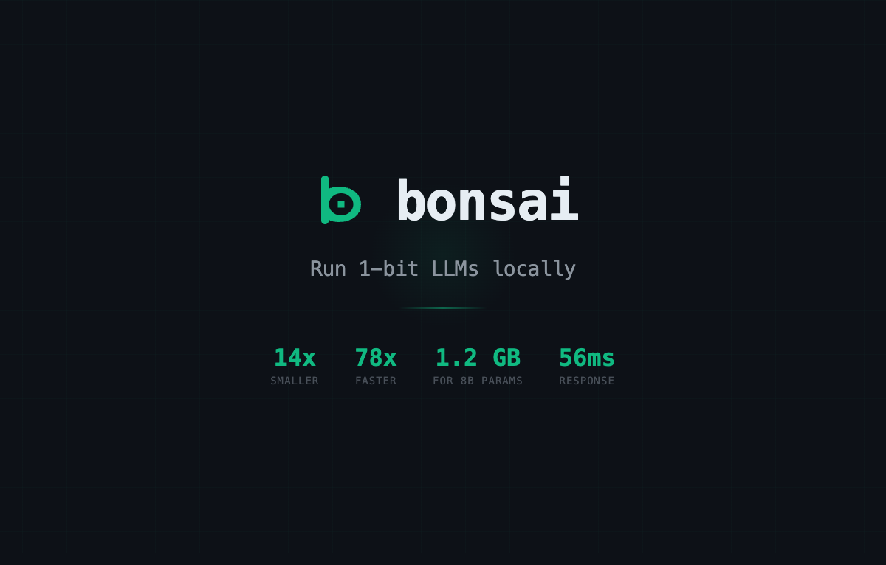

<div align="center">



[](https://go.dev)
[](LICENSE)
[](https://github.com/ggml-org/llama.cpp)
[](https://huggingface.co/collections/prism-ml/bonsai-6800591046eb822fb3b82541)

[Quick Start](#quick-start) · [Models](#bonsai-models) · [Commands](#commands) · [Configuration](#configuration)

</div>

---

Bonsai is a CLI that makes it easy to run [prism-ml's Bonsai 1-bit quantized models](https://huggingface.co/collections/prism-ml/bonsai-6800591046eb822fb3b82541) locally using [llama.cpp](https://github.com/ggml-org/llama.cpp). These models are 14x smaller than full-precision equivalents, use 4-5x less energy, and deliver fast inference on consumer hardware. Bonsai handles everything -- model downloads from HuggingFace, server lifecycle management, and an OpenAI-compatible API -- with zero configuration.

## Bonsai Models

The [prism-ml Bonsai models](https://huggingface.co/collections/prism-ml/bonsai-6800591046eb822fb3b82541) use **true 1-bit quantization** across all layers -- embeddings, attention, MLP, and output head. No escape hatches, no mixed-precision workarounds.

| Model | Parameters | Size | Pull Command |
|-------|-----------|------|-------------|
| **bonsai-8b** | 8B | ~1.2 GB | `bonsai pull bonsai-8b` |
| **bonsai-4b** | 4B | ~572 MB | `bonsai pull bonsai-4b` |
| **bonsai-1.7b** | 1.7B | ~248 MB | `bonsai pull bonsai-1.7b` |

### Why 1-Bit?

- **14x smaller** than FP16 equivalents
- **4-5x lower energy** consumption per token
- **Fast inference**: 40 tok/s on iPhone, 131 tok/s on M4 Pro, 368 tok/s on RTX 4090
- **Intelligence density**: 1.06 intelligence/GB vs 0.10 for full precision -- 10x more capability per byte
- **GGUF format** -- runs directly with llama.cpp, no conversion needed

Models by [prism-ml](https://huggingface.co/prism-ml) -- [explore the collection on HuggingFace](https://huggingface.co/collections/prism-ml/bonsai-6800591046eb822fb3b82541).

## Features

- **Zero-config inference** -- `bonsai run` auto-starts the server, loads the model, and starts chatting
- **Built-in Bonsai registry** -- pull models by shortname (`bonsai pull bonsai-4b`), downloads directly from HuggingFace
- **Full model management** -- pull, list, show, run, stop, remove, copy
- **Interactive chat** -- multi-turn conversations with streaming output
- **One-shot prompts** -- `bonsai run bonsai-4b "explain monads"`
- **Smart model resolution** -- auto-selects the best available Bonsai model
- **OpenAI-compatible API** -- works with any OpenAI SDK, LangChain, etc.
- **Server lifecycle management** -- auto-start, PID tracking, health checks
- **Progress tracking** -- download progress bars
- **Lightweight** -- single binary, ~1,500 LOC, two dependencies (cobra + uuid)
- **No Ollama required** -- talks directly to llama.cpp server via OpenAI-compatible API

## Why llama.cpp Instead of Ollama?

Bonsai v1 used [Ollama](https://ollama.com) as its inference backend. We moved to direct [llama.cpp](https://github.com/ggml-org/llama.cpp) integration in v2 for significant performance and control improvements:

| | Ollama | llama.cpp (direct) |
|---|---|---|
| **Response time** (simple query) | 4,585 ms | **56 ms** (78x faster) |
| **Forced thinking mode** | Yes -- Qwen3 template injects `<think>` tags | No -- clean responses |
| **Wasted tokens** | 160-265 thinking tokens per response | 0 |
| **Dependencies** | Ollama daemon + Go SDK + 8 transitive deps | Single `llama-server` binary |
| **Model storage** | Opaque blob store (`~/.ollama/models/blobs/`) | Plain GGUF files you control |
| **Template control** | Locked to Ollama's per-family templates | Full control, no forced behavior |

### The core problem

The Bonsai models are based on Qwen3. Ollama's Qwen3 chat template unconditionally injects a `<think>` tag at the start of every assistant response:

```
<|im_start|>assistant
<think>
```

This forces the model into chain-of-thought reasoning mode on every single query -- even "What is 2+2?" generates 160-265 internal reasoning tokens before producing the actual answer. This template is baked into Ollama and cannot be overridden per-request.

### What llama.cpp gives us

- **Direct GGUF inference** -- no middleware, no template injection, no abstraction tax
- **OpenAI-compatible API** -- llama-server exposes `/v1/chat/completions` natively, same protocol any OpenAI SDK speaks
- **Transparent model files** -- GGUF files in `~/.bonsai/models/` that you can inspect, copy, or share
- **One fewer dependency** -- no need to install and run a separate Ollama daemon
- **Full control** -- inference parameters, threading, GPU layers, batch size all configurable

> **Note:** Bonsai still works with any OpenAI-compatible server. If you prefer Ollama, vLLM, or another backend, just point `BONSAI_HOST` at it.

## Quick Start

### Prerequisites

[llama.cpp](https://github.com/ggml-org/llama.cpp) server must be available:

```bash
# macOS
brew install llama.cpp

# Or build from source
git clone https://github.com/ggml-org/llama.cpp && cd llama.cpp
cmake -B build && cmake --build build -j
```

> **Note:** Bonsai auto-detects `llama-server` in your PATH or common locations. You can also set `LLAMA_SERVER_BIN` to point to the binary.

### Install Bonsai

```bash
go install github.com/nareshnavinash/bonsai@latest
```

Or download a binary from [Releases](https://github.com/nareshnavinash/bonsai/releases).

### Run

```bash
# Pull a model (~572 MB)
bonsai pull bonsai-4b

# Start chatting (auto-starts the server)
bonsai run

# Or one-shot
bonsai run bonsai-4b "what is quantum computing?"
```

## Commands

| Command | Description |
|---------|-------------|
| `bonsai run [model] [prompt]` | Start a chat session or run a one-shot prompt |
| `bonsai pull <model>` | Download a model from HuggingFace |
| `bonsai list` | List installed models |
| `bonsai show <model>` | Show model details |
| `bonsai models` | List available Bonsai models |
| `bonsai ps` | Show running server status |
| `bonsai stop` | Stop the server |
| `bonsai rm <model>` | Remove a model |
| `bonsai cp <src> <dest>` | Copy a model file |
| `bonsai serve [model]` | Start the llama-server (foreground) |
| `bonsai api` | Start OpenAI-compatible API server |
| `bonsai status` | Show server status |

## API Server

Bonsai can expose an OpenAI-compatible HTTP API, letting any application that speaks the OpenAI format interact with your local Bonsai models.

```bash
# Start the API server
bonsai api                    # localhost:8080
bonsai api --port 3000        # custom port
bonsai api --host 0.0.0.0    # all interfaces
```

### Endpoints

| Method | Path | Description |
|--------|------|-------------|
| POST | `/v1/chat/completions` | Chat completions (streaming & non-streaming) |
| GET | `/v1/models` | List available models |
| GET | `/health` | Health check |

### Usage with OpenAI SDK

```python
from openai import OpenAI

client = OpenAI(base_url="http://localhost:8080/v1", api_key="unused")
response = client.chat.completions.create(
    model="bonsai-4b",
    messages=[{"role": "user", "content": "hello"}]
)
print(response.choices[0].message.content)
```

### Usage with curl

```bash
curl http://localhost:8080/v1/chat/completions \
  -H "Content-Type: application/json" \
  -d '{"model":"bonsai-4b","messages":[{"role":"user","content":"hello"}]}'
```

Works with LangChain, LlamaIndex, Continue.dev, Cursor, and any OpenAI-compatible client.

## Configuration

| Variable | Default | Description |
|----------|---------|-------------|
| `BONSAI_MODEL` | `bonsai-8b` | Preferred model |
| `BONSAI_HOST` | `http://127.0.0.1:8081` | Server URL |
| `BONSAI_PORT` | `8081` | Server port |
| `BONSAI_THREADS` | CPU count | Inference threads |
| `BONSAI_MODELS_DIR` | `~/.bonsai/models/` | Model storage directory |
| `LLAMA_SERVER_BIN` | auto-detect | Path to llama-server binary |

### Model Resolution Order

1. `BONSAI_MODEL` environment variable (if set)
2. Any locally installed model with "bonsai" in its name
3. Any locally installed GGUF model
4. Helpful error message with pull instructions

### Chat Commands

In interactive mode (`bonsai run`):

| Command | Description |
|---------|-------------|
| `/bye` or `/exit` | Exit the chat |
| `/clear` | Clear conversation history |
| `/model <name>` | Switch to a different model |
| `/set temperature <value>` | Adjust creativity (0.0-2.0) |
| `/set top_p <value>` | Adjust nucleus sampling |
| `"""` | Start multi-line input (end with `"""`) |

## Architecture

```
bonsai run "hello"
    │
    ├── Resolve model name → find GGUF file
    ├── Auto-start llama-server (if not running)
    ├── Send request via OpenAI-compatible HTTP API
    └── Stream response tokens to terminal
```

Bonsai manages the full lifecycle:
- **Models** stored as GGUF files in `~/.bonsai/models/`
- **Server** process tracked via PID file at `~/.bonsai/server.pid`
- **Logs** written to `~/.bonsai/server.log`
- **Compatible** with any OpenAI-compatible server via `BONSAI_HOST`

## Contributing

Contributions are welcome. Please open an issue first to discuss what you would like to change.

```bash
git clone https://github.com/nareshnavinash/bonsai.git
cd bonsai
go build -o bonsai .
./bonsai status
```

## License

[MIT](LICENSE)

## Acknowledgments

- **[prism-ml](https://huggingface.co/prism-ml)** for the Bonsai 1-bit quantized model family
- **[llama.cpp](https://github.com/ggml-org/llama.cpp)** for the inference engine
- **[Cobra](https://github.com/spf13/cobra)** for the CLI framework
